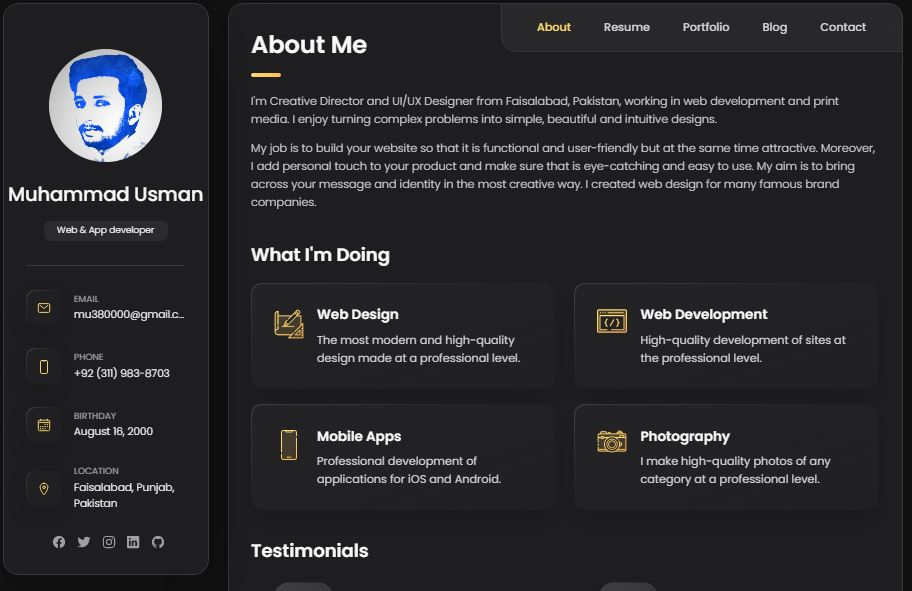

# RK - Personal portfolio


This is a fully responsive personal portfolio website, responsive for all devices, built using HTML, CSS, and JavaScript.

## Demo

![ Live Demo ] (https://rkusman.github.io/RK-Personal-Portfolio/)




## Prerequisites

Before you begin, ensure you have met the following requirements:

* [Git](https://git-scm.com/downloads "Download Git") must be installed on your operating system.

## Installing RK-Personal portfolio

To install **RK - Personal portfolio**, follow these steps:

Linux and macOS:

```bash
sudo git clone https://github.com/RkUsman/RK-Personal-Portfolio.git
```

Windows:

```bash
git clone https://github.com/RkUsman/RK-Personal-Portfolio.git
```

## Contact

If you want to contact me you can reach me at [Twitter](https://www.twitter.com/RkUsman44).

## License

This project is **free to use** and does not contains any license.
